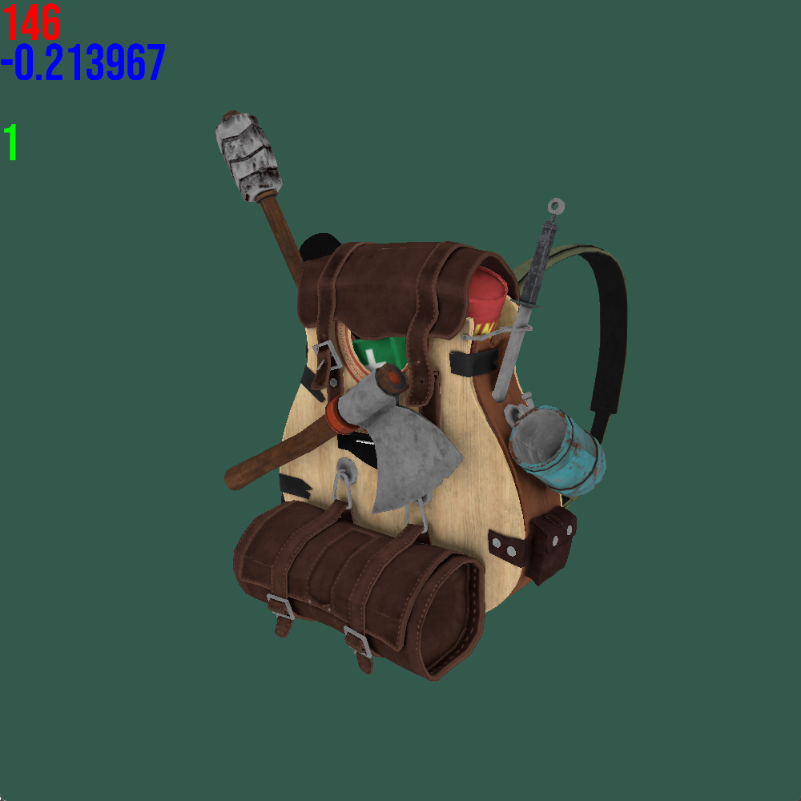
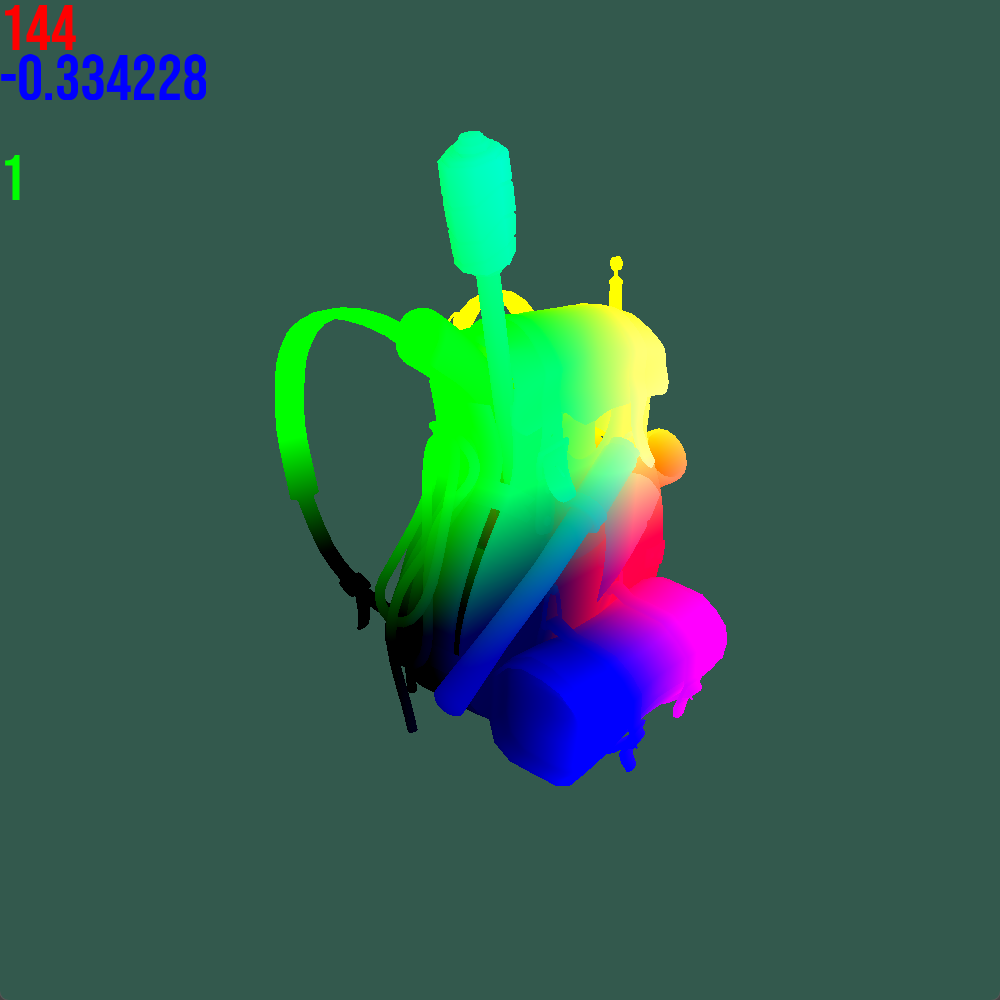

# Open Game Framework Attempt (WIP)

## Purpose

The main idea behind this project is inspired by rapid prototype development. This method requires you to develop your prototype app or game as quickly as possible. If you can do that, you gain an advantage in exploring new ideas, game mechanics, and other creative concepts.

I decided to create a highly modular framework that others can use for developing prototypes. Developers can either continue using this framework or easily migrate their projects to larger game engines like Unreal Engine or Unity.

## Roadmap (WIP)

### ~~Text~~
- ~~Font loading~~
- ~~Adjustable size and resolution~~
- ~~Display `std::string` in C++~~

### Loading
- ~~Load textures~~
- ~~Load 3D models with textures~~
- Load scenes
- ~~Image rendering~~
- Advanced model manipulations
- Scene exporting

### Other Features
- Exclusion mechanisms
- Basic shading techniques (e.g., Phong, Blinn-Phong)
- Lighting
  - Basic materials (Iron, Wood, Gold, etc.)
  - Various light types (sunlight, point light, cone light, etc.)
- Shadows
  - Shadow projection
  - Soft shadows
- Physics integration
  - Likely using [Bullet](https://github.com/bulletphysics/bullet3) for 3D physics
  - Separate handling for 2D and 3D physics for optimization
- Compositing
  - Addressing rendering issues like shadow acne and anti-aliasing
  - Implementation of new compositing techniques
- PBR (Physically Based Rendering) material integration
- Volume rendering
- Simulations
  - Water simulation
  - Fog simulation
- Ray tracing renderer
- (Optional) Ray marching solutions for modeling

## Current Render Progress

Some screenshots from the current state of rendering:

  

Model by Berk Gedik, [Sketchfab Link.](https://sketchfab.com/3d-models/survival-guitar-backpack-low-poly-799f8c4511f84fab8c3f12887f7e6b36)

